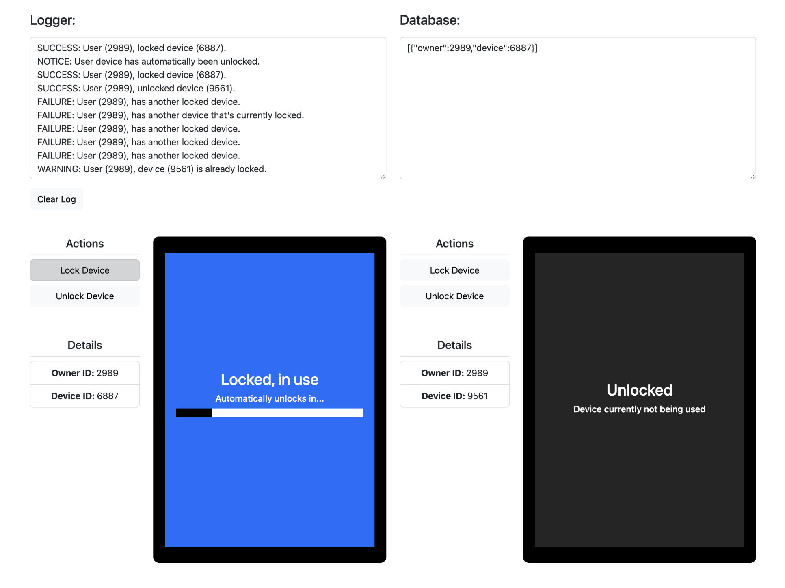

# Device Locking Demo

Makes use of [Re-frame](https://day8.github.io/re-frame/) and [ClojureScript](https://clojurescript.org/).

## Requirements:

1. L-DA-S, U-DA-S, L-DB-S, U-DB-S.
2. L-DA-S, L-DB-F, U-DA-S, L-DB-S.
3. L-DA-S, DA-Lost, L-DB-F, WAIT..., L-DB-S.
4. L-DA-S, L-DA-?.
5. L-DA-S, DA-Active-1-hour, L-DB-F, U-DA-S, L-DB-S.

#### Verbose requirements:

- **Case 1**:
    - Lock device A, success.
    - Unlock device A, success.
    - Lock device B, success.
    - Unlock device B, success.
- **Case 2**:
    - Lock device A, success.
    - Lock device B, failure.
    - Unlock device A, success.
    - Lock device B, success.
- **Case 3**:
    - Lock device A, success.
    - Lose device A (stolen, broken, lost, auto unlock).
    - Lock device B, failure.
    - Wait X amount of time.
    - Lock device B, success.
- **Case 4**:
    - Lock device A, success.
    - Lock device A, ?.
      - This might indicate malicious use cases, device emulations. Measuring the delta between requests and the frequencies of locked states might be a good approach to detect malicious uses. Basically we want to disallow a device from getting locked twice, if it matches a certain pattern.
- **Case 5**:
    - Lock device A, success.
    - Use device A for X amount of time.
    - Lock device B, failure.
    - unlock device A, success.
    - Lock device B, success.
